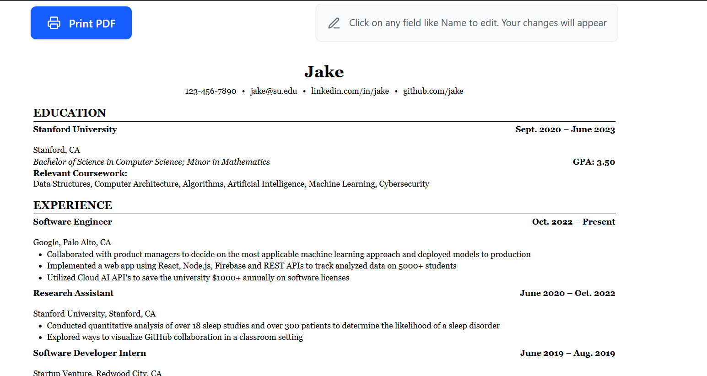
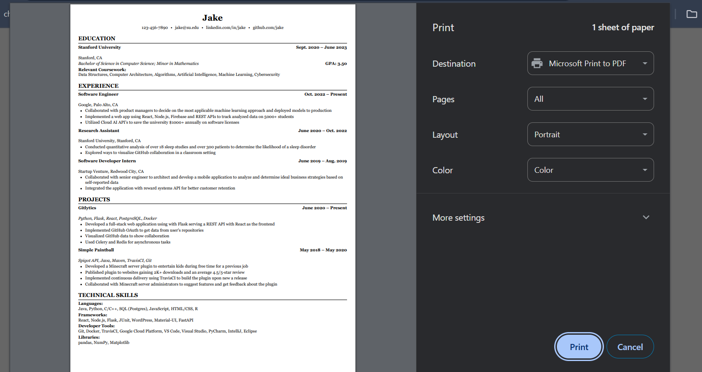

# CV Creator Inline

Create slick CVs on the go. Edit text inline. See changes live. Download as PDF. No login. No fluff.

### Features

- Edit text inline (name, skills, etc.)
- Instant preview
- One-click PDF download
- No login required
- Mobile-friendly AF

### Tech Stack

- Next.js
- TypeScript
- Tailwind CSS

### Setup

```bash
git clone https://github.com/oranjan/cv-creator
cd cv-app
npm install
npm run dev
```

### 📸 Screenshots

  
_Main editing interface with inline text editing_


_Clean preview mode ready for PDF download_

## Live Demo

[View Live Demo](https://your-deployment-url.com)

## Contact

- GitHub: [@oranjan](https://github.com/oranjan)
- Email: ranjnmehta@gmail.com
